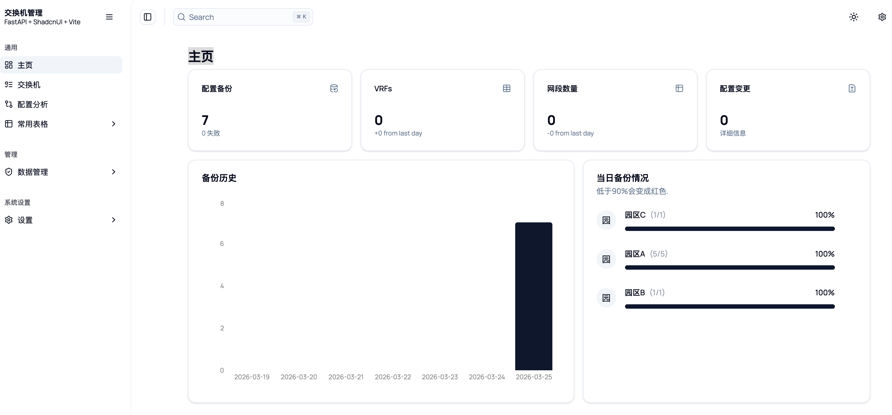
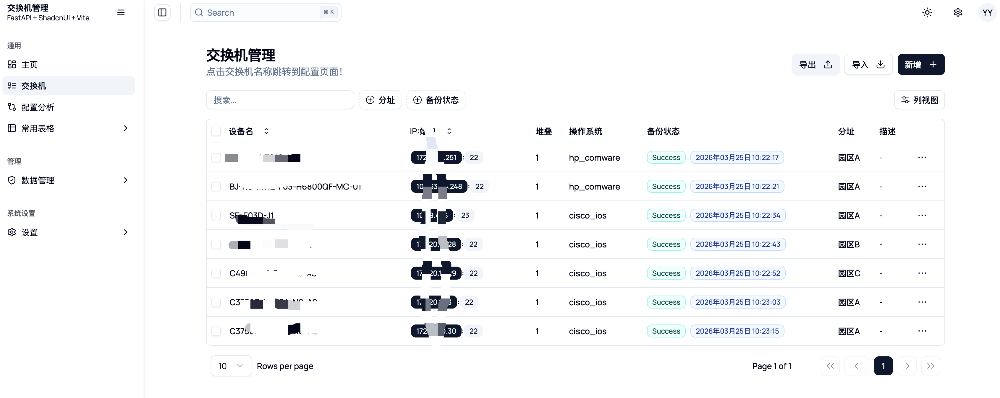
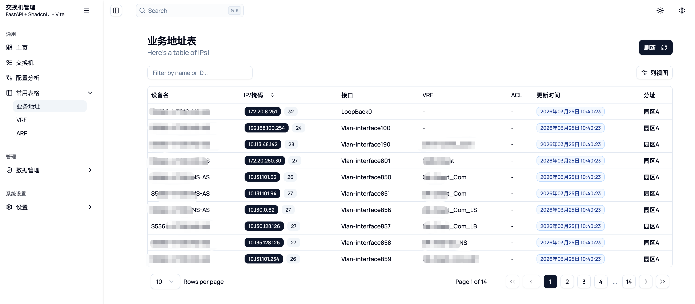
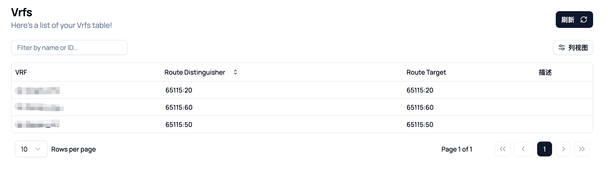
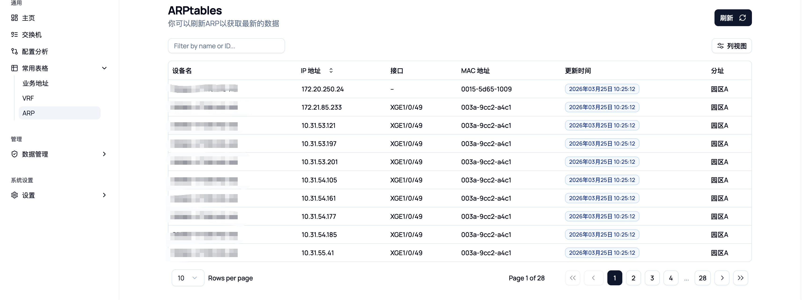
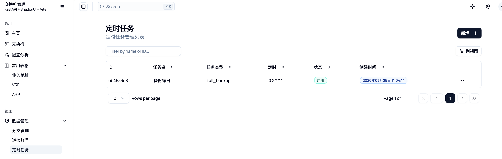
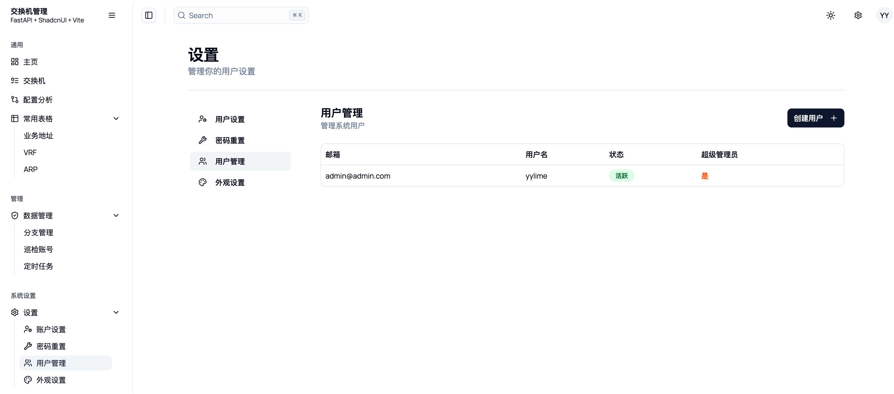

# 交换机配置管理Web服务

::: tip
当前项目属于一个学习项目，其实主要是学习一下前后端分离的项目如何写，加上工作后刚好负责网络运维部分工作，基于Django写了内部的项目，功能比当前肯定丰富。随着AI编程的兴起，就打算结合免费AI将部分核心功能做一个基础的Demo加深学习，本项目结合了一些实际工作中的运维经验，希望能实际工作中对提高运维效率和运维自动化开发学习有所帮助。
:::
### 项目背景
当前系统内交换机数量大概有2k多台，网络架构走的MPLS-VPN，设备主要涉及思科、华为、华三等厂家。虽然各厂家现在主推各自的云管平台，都实现了配置下发、对比等等核心功能，但是不同厂商之间的适配度其实不是很好，并且运维内部肯定希望将自己的一些工作经验（工单自动化、设备统计、配置对比、告警分析等等）加入到自动化当中，所以单独开发一个配置管理工具是有一定的作用的。

**主要参考并使用的开源项目**

主要是将shadcn的ui替换为full-stack-fastapi-template中的frontend，然后借助netmiko实现了主要功能。
- https://github.com/fastapi/full-stack-fastapi-template
- https://github.com/satnaing/shadcn-admin

[Switch Manager](https://github.com/yylime/switch-manager)是一个基于 FastAPI 和 React 的全栈应用程序，用于管理和监控网络交换机配置。

**[常见问题和细致的介绍在这里查看](https://yylime.com/network/switch-manager)** 

**项目前的一些思考**

- 这不是一个监控工具，监控当前主流zabbix+grafana是一个不错的选择。
- 设备登录认证主流应该还是aaa服务器，本项目中的巡检账号的权限也是要特别注意。
- 这也不是一个ssh工具，webssh和webtelnet实现并不复杂，你可以轻松的将其加入本项目。
- 备份的时间选择当前是每天保留一份，但我看类似的项目中保存很多，优雅的保存应该是如果配置没有发生变化，那么可以保存一个指针指向上一次的配置即可

## 功能
::: warning
当前测试的设备型号cisco_ios、cisco_nxos、hp_comware（华三）、huawei（CE系列和S系列），以上几种型号下列功能都支持，如果您的设备型号不在上述其中，您可以手动进行代码的卡法，后续给出代码所在具体位置。
:::
**已经实现的功能**
- 交换机批量导入和导出，巡检账号、分址自动创建，配置查看
- 三种定时任务，全量备份、仅备份失败（部分设备每天开关机）、ARP刷新
- IP表、VRF、ARP表信息生成
- 每日配置变更和自定义设备配置对比
- 巡检账号和分址自定义管理
- 设备型号自动识别

**尚未完成的功能**
- 后台运行日志前端展示
- webssh开发
- ...

## 系统部分截图
Dashboard

交换机页面

交换机三层接口

VRF

ARP

定时任务

用户管理
